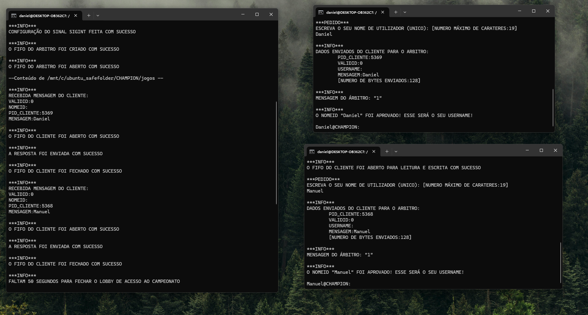

# CHAMPION
CHAMPION is a C-based Unix system that manages single-player game tournaments. It acts as a referee, handling communication between players and games, assigning games, and maintaining scoreboards using OS-level mechanisms like pipes and processes.

Discover additional projects from this class in the [Sistemas Operativos repository](https://github.com/danielmribeiro/isec-lei-sistemas-operativos).

For more course-related assignments, check out the [Engenharia Informatica repository](https://github.com/danielmribeiro/engenharia-informatica).

